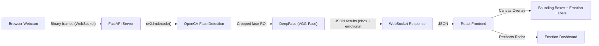

# Shape Detection Using OpenCV Contours + approxPolyDP

## Project Overview

This project detects and classifies basic geometric shapes from an input image using OpenCV and Python.

The system identifies the following shapes:

- Triangle
- Square
- Rectangle
- Pentagon
- Hexagon
- Circle
- Oval

It uses contour detection and polygon approximation to determine the number of sides and shape properties.

---

# EmotiSense AI

A real-time Facial Emotion Recognition (FER) web application built with FastAPI, React (Vite), OpenCV, and DeepFace.

  

## Overview

This project implements an end-to-end Computer Vision pipeline for detecting faces and classifying their emotional state in real-time via a web browser. 

The system leverages a client-server architecture:
1. **Frontend**: Captures webcam frames using the HTML5 `<video>` and Canvas APIs, and streams binary JPEG frames to the backend.
2. **Backend**: Processes incoming frames over WebSockets. Uses OpenCV's Haar Cascade for rapid face localization, followed by DeepFace (a deep learning facial recognition framework) to classify emotions into 7 categories.
3. **Dashboard**: Receives real-time JSON responses and overlays bounding boxes and emotion probabilities on a sleek, sci-fi themed UI built with Tailwind CSS and Framer Motion.

## Features

- **Real-Time Streaming**: Low-latency WebSocket communication.
- **Robust Face Detection**: Utilizes OpenCV for fast and reliable face cropping.
- **Deep Learning Inference**: Powered by the pre-trained `VGG-Face` model via the `deepface` library.
- **Modern Cyberpunk UI**: Built with React, Tailwind CSS v3, and Framer Motion.
- **Interactive Data Visualization**: Real-time Recharts Radar Chart and animated progress bars.

## Architecture



## Setup & Installation

### Prerequisites
- Python 3.9+
- Node.js 18+
- Webcam

### Backend Setup

1. Navigate to the backend directory:
   ```bash
   cd backend
   ```
2. Create and activate a virtual environment:
   ```bash
   python -m venv venv
   # Windows
   .\venv\Scripts\activate
   # macOS/Linux
   source venv/bin/activate
   ```
3. Install dependencies:
   ```bash
   pip install -r requirements.txt
   ```
   > **Note:** The first time you run the backend, DeepFace will automatically download the pre-trained model weights (~6MB for the emotion model).

### Frontend Setup

1. Navigate to the frontend directory:
   ```bash
   cd frontend
   ```
2. Install Node modules:
   ```bash
   npm install
   ```

## Running the Application

1. **Start the Backend Server**:
   ```bash
   cd backend
   uvicorn main:app --host 0.0.0.0 --port 8000
   ```

2. **Start the Frontend Dev Server**:
   ```bash
   cd frontend
   npm run dev
   ```

3. **Access the App**:
   Open your browser and navigate to `http://localhost:5173`. Click "Start Camera" to begin emotion detection.

## Computer Vision Pipeline Details

1. **Frame Capture**: Frontend scales the frame and converts it to a JPEG blob to minimize network bandwidth.
2. **Face Detection**: The server runs `cv2.CascadeClassifier` on the grayscale frame to isolate the facial Region of Interest (ROI).
3. **Emotion Classification**: The cropped ROI is passed to `DeepFace.analyze(actions=['emotion'])`. DeepFace processes the image through its CNN architecture to predict probability scores across 7 emotions: `Angry, Disgust, Fear, Happy, Sad, Surprise, Neutral`.

## Dependencies

- **FastAPI / Uvicorn / WebSockets**: High-performance asynchronous backend.
- **OpenCV-Python**: Image manipulation and face detection.
- **DeepFace / TensorFlow-Keras**: Pre-trained deep learning inference.
- **React / Vite**: Fast frontend framework.
- **Tailwind CSS**: Utility-first CSS styling for the dark sci-fi theme.
- **Framer Motion**: Production-ready UI animations.
- **Recharts**: Data visualization library for the Radar Chart.

## License

This project was developed for academic purposes.

---

# Pull Request / Repository Title Format

To build a simple computer vision application that can detect shapes from images using image processing techniques.

---

## Technologies Used

- Python 3.12.0
- OpenCV
- NumPy
- Math Library

---

## Project Structure

```text
Shape-Detection-Project/
│── shape_detection.py
│── README.md
│── input_images/
│   ├── circle.png
│   ├── hexagon.png
│   ├── mix.png
│   ├── oval.png
│   ├── pentagon.png
│   ├── rectangle.png
│   └── square.png
│
│── output_images/
│   ├── circle_output.png
│   ├── hexagon_output.png
│   ├── mix_output_1.png
│   ├── mix_output_2.png
│   ├── oval_output.png
│   ├── pentagon_output.png
│   ├── rectangle_output.png
│   └── square_output.png
````

---

## Installation

Install required libraries:

```bash
pip install opencv-python numpy
```

---

## How to Run

1. Place your image inside the `input_images` folder.

2. Update image path inside code:

```python
image = cv2.imread("input_images/square.png")
```

3. Run the program:

```bash
python shape_detection.py
```

---

## Working Process

### 1. Load Image

Reads input image using OpenCV.

### 2. Preprocessing

* Convert to grayscale
* Apply Gaussian Blur
* Perform Canny Edge Detection
* Morphological operations

### 3. Contour Detection

Finds external contours from image.

### 4. Shape Classification

Based on contour vertices:

* 3 Vertices = Triangle
* 4 Vertices = Square / Rectangle
* 5 Vertices = Pentagon
* 6 Vertices = Hexagon
* More Vertices = Circle / Oval

### 5. Output

Contours are drawn and shape name is displayed.

---

## Sample Output

**Input Image:**
`input_images/square.png`

**Detected Output:**

* Shape boundary in Green
* Shape label in Blue


---

## Applications

* Object Recognition
* Industrial Shape Inspection
* Educational Projects
* Basic Computer Vision Tasks

---

## Future Improvements

* Real-time webcam detection
* Rotated rectangle detection
* Multiple object tracking
* Color + shape recognition

---

## Authors

* **BT23F05F028** – Vednarayan Hiralkar
* **BT23F05F060** – Aryan Shastri

Project developed for academic mini project submission.

---

## License

- Use proper folder structure.
- Keep code clean and well documented.
- Repository name must strictly follow the given format.
- Incomplete or incorrectly named submissions may not be considered for evaluation.

---
# YOLO-World Object Detection Project

This project detects many common real-world objects from a webcam, image, or video using Ultralytics YOLO-World.

It is set up to work well for examples like:

- person
- bottle
- pen
- mobile phone
- chair
- laptop / computer monitor
- keyboard
- mouse
- book
- cup

## What makes this project better

- Uses YOLO-World, so you are not limited to the default 80 COCO classes.
- Supports webcam, image, and video input.
- Shows live bounding boxes, confidence labels, FPS, and object counts.
- Lets you extend detection with your own prompts.
- Can save processed image and video outputs.
- Includes a ready prompt file for common indoor and study objects.

## Project files

- `app.py` - main detection app
- `prompts/common_objects.txt` - default object prompts
- `requirements.txt` - Python dependencies

## Install

Create and activate a virtual environment if you want:

```powershell
python -m venv .venv
.venv\Scripts\activate
```

Install dependencies:

```powershell
pip install -r requirements.txt
```

## Run

### 1. Webcam detection

```powershell
python app.py --source 0 --save
```

### 2. Detect objects in an image

```powershell
python app.py --source path\to\image.jpg --save
```

### 3. Detect objects in a video

```powershell
python app.py --source path\to\video.mp4 --track --save
```

### 4. Add more custom objects

```powershell
python app.py --source 0 --prompts "notebook,whiteboard,projector,water bottle"
```

### 5. Use default COCO classes only

```powershell
python app.py --source 0 --use-coco
```

## Useful options

- `--model weights/yolov8s-worldv2.pt` - balanced default model
- `--imgsz 1280` - better for small objects like pens, but slower
- `--track` - keep track IDs in video/webcam streams
- `--save` - save output into the `outputs/` folder
- `--no-show` - run without opening a window
- `--prompts "object1,object2"` - append extra custom object prompts
- `--prompt-file prompts/common_objects.txt` - load prompts from a text file
- `--save-prompt-model custom_study_detector.pt` - save a prompt-specialized model

## Controls while webcam/video is running

- `q` or `Esc` - quit
- `s` - save a snapshot frame

## Important note

No model can reliably detect "every object" in every situation. YOLO-World is much better than a fixed small class list, but results still depend on:

- camera quality
- lighting
- object size
- viewing angle
- whether your prompt text matches the object well

For tiny or very specific objects, do these things for better accuracy:

1. Increase image size with `--imgsz 1280`
2. Bring the object closer to the camera
3. Use clearer prompts such as `mobile phone` instead of `phone`
4. Switch to a larger model like `yolov8m-worldv2.pt` or `yolov8l-worldv2.pt`
5. Train a custom detector if you need very high accuracy for a special object class

## First-run downloads

On first run, Ultralytics may download:

- YOLO-World model weights
- CLIP text-model weights used for custom prompts

The app keeps the CLIP cache inside the project under `.cache_home/` so it does not depend on a global user cache path.

After that, the app can usually reuse the cached files.
